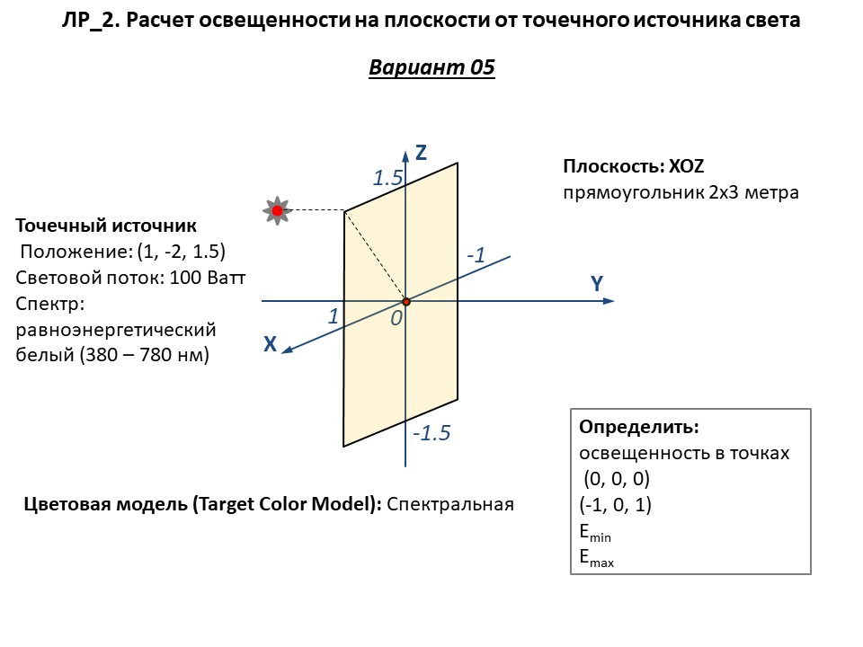
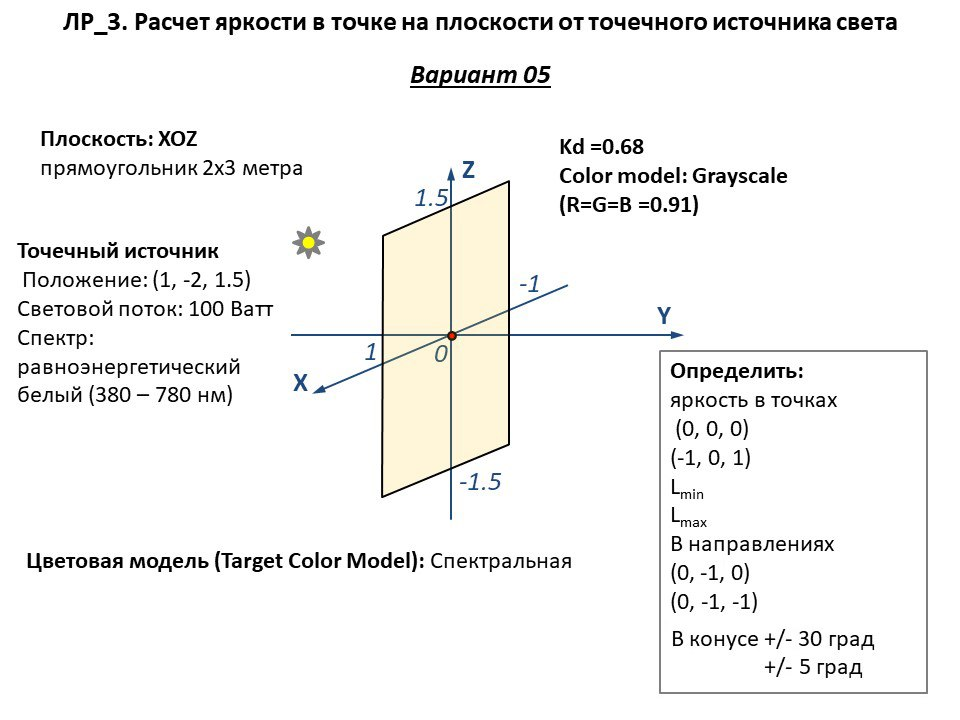

# Лабораторная №1: Моделирование элементарных источников и приемников светового излучения с помощью комплекса программ Lumicept #

***Исходные материалы и оборудование:***

Компьютер с установленным комплексом программ компьютерной графики и оптического моделирования Lumicept.

***Цель работы:***

Овладеть навыками компьютерного моделирования элементарных источников и приемников светового излучения с использованием комплекса программ Lumicept.

***Задачи:***

- Создать новую сцену.
- Создать элементарные геометрические объекты.
- Импортировать в сцену модели источников света различных типов из библиотеки объектов.
- Изучить свойства источников.
- Научиться позиционировать источники излучения в пространстве.
- Сформировать в сцене модели приемников излучения различных типов (plane
observer, gonio-observer). В том числе с помощью API (Python).
- Задать параметры приемника излучения и его положение в пространстве.
- Выполнить визуальную трассировку лучей.
- Выполнить расчет карт освещенности на заданном приемнике.

Отчет представить в электронном виде: Формат MS Word или MS PowerPoint, эскиз схемы с указанием заданных параметров. Для подготовки эскиза можно использовать скриншоты из Lumicept. Записать финальную сцену. К отчету приложить файлы сцены (`*.iof`) и скрипта (`*.py`).

# Лабораторная №2: Расчет освещенности на плоскости от точечного источника света.#

***Исходные данные:***

Система координат, плоскость (прямоугольник), точечный источник света с равноинтенсивной диаграммой излучения, координаты точек в которых следует рассчитать освещенность.

***Цель работы:***

Овладеть навыками расчета освещенности на плоскости как аналитически, так и с помощью компьютерного моделирования с использованием комплекса программ Lumicept.

***Задачи:***

- Провести аналитический расчет освещенности в заданных точках на плоскости.
- Сформировать сцену в Lumicept с заданной геометрией.
- Провести численный расчет освещенности в заданных точках плоскости с помощью программного комплекса Lumicept.

Отчет представить в электронном виде: Формат MS Word или MS PowerPoint, эскиз схемы с указанием заданных параметров. Для подготовки эскиза можно использовать скриншоты из Lumicept. Записать финальную сцену. К отчету приложить файлы сцены (`*.iof`) и скрипта (`*.py`).

# Лабораторная №3: Расчет яркости в точке на плоскости от точечного источника света. #

***Исходные данные:***

Система координат, диффузная плоскость, коэффициент диффузного отражения, библиотека двунаправленных функций рассеяния (ДФР, BSDF), точечный источник света с равноинтенсивной диаграммой излучения, координаты точек в которых следует рассчитать яркость.

***Цель работы:***

Овладеть навыками расчета яркости на диффузной плоскости как аналитически, так и с помощью компьютерного моделирования с использованием комплекса программ Lumicept.

***Задачи:***

- Провести аналитический расчет яркости в заданных точках плоскости.
- Сформировать сцену в Lumicept с заданной геометрией и оптическими свойствами.
- Провести численный расчет яркости в заданных точках плоскости с помощью программного комплекса Lumicept.
- Провести моделирование изображения с различными двунаправленными функциями отражения (ДФО, BRDF).

Отчет представить в электронном виде: Формат MS Word или MS PowerPoint, эскиз схемы с указанием заданных точек. Для подготовки эскиза можно использовать скриншоты из Lumicept. Результаты моделирования представить в виде таблицы. Сравнить с результатами аналитического расчета. К отчету приложить файл скрипта (*.py) и финальной сцены (*.iof).

# Лабораторная №4: Формирование файлов изображений с широким динамическим диапазоном HDRI и работа с ними в программном комплексе Lumicept. #

***Исходные данные:***

Компьютер с установленным комплексом программ компьютерной графики и оптического моделирования Lumicept; Файл изображения в NIT-формате; Lumicept API.

***Цель работы:***

Овладеть навыками работы с файлами изображений с широким динамическим диапазоном HDRI.

***Задачи:***

- Написать программу чтения NIT-файла и его записи в текстовом формате. 
- Написать программу записи NIT-файла имея данные об изображении в текстовом формате. 
- Запустить LumiVue и сравнить исходное изображение с конвертированным из текстового файла. 

Отчет представить в электронном виде: Формат MS Word. Можно использовать скриншоты из Lumicept. К отчету приложить тексты программ и файлы изображений в текстовом и бинарном форматах. 

# Лабораторная №5: Моделирование линзовой камеры. #

***Исходные данные:***

Компьютер с установленным комплексом программ компьютерной графики и оптического моделирования Lumicept; Lumicept API.

***Цель работы:***

Овладеть навыками компьютерного моделирования изображений 3D сцен, сформированных с использованием линзовой камеры.

***Задачи:***

- Сформировать сцену с использованием встроенной библиотеки параметрических объектов. Геометрия – произвольная, оптические свойства поверхностей – диффузные, параметры источника света в зависимости от типа трассировки лучей.
- Определить глубину резкости.
- Провести моделирование для идеальной линзы методом прямой трассировки (с использованием модели приемника Lens Observer) при различных диаметрах линзы.
- Провести моделирование для идеальной линзы методом обратной трассировки (с использованием метода Path Tracing для камеры с идеальной линзой) при различных диаметрах линзы.

Отчет представить в электронном виде: Формат MS Word. Можно использовать скриншоты из Lumicept. К отчету приложить тексты программ и файлы изображений в текстовом и бинарном форматах. 

# Курсовая работа #

***Задание:***

Объектом исследования является процесс синтеза и визуализации фотореалистичных изображений с помощью компьютера. Выполнение курсовой работы (цель) состоит в разработке программы - трассировщика лучей (рендерера), результатом работы которой станет изображение (или набор изображений).
